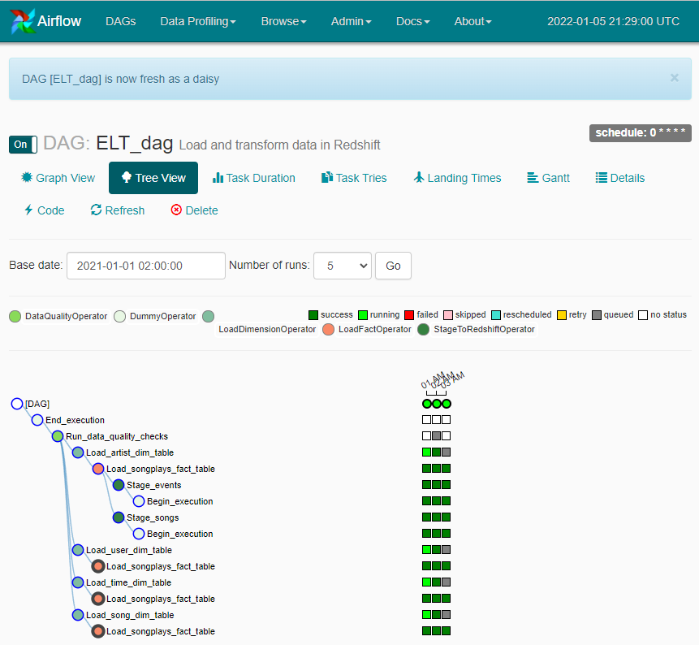

# Data Pipelines using Apache Airflow and AWS Redshift


## Summary

This demo project conducts ETL operations on JSON files from AWS S3 and load data into AWS REdshift. 
Apache Airflow schedules and runs the corresponding data pipeline.   

The first step is to load data from AWS S3 into AWS Redshift. 
The second step processes the data resources and writes results into five tables that model is star schema.


## Data
The data sets consists of two datasets of files, that are provided in AWS S3 data lakes:

- Song dataset (available at `s3://udacity-dend/song_data`) contains JSON files, like  

        {
        "num_songs": 1, 
        "artist_id": "AR8ZCNI1187B9A069B", 
        "artist_latitude": null, 
        "artist_longitude": null, 
        "artist_location": "", 
        "artist_name": "Planet P Project", 
        "song_id": "SOIAZJW12AB01853F1", 
        "title": "Pink World", 
        "duration": 269.81832, 
        "year": 1984
        }
  
- Log dataset (available at `s3://udacity-dend/log_data`) contains JSON files, like
  
        {
        "artist":"N.E.R.D. FEATURING MALICE",
        "auth":"Logged In",
        "firstName":"Jayden",				
        "gender":"M",						
        "itemInSession":0,
        "lastName":"Fox",					
        "length":288.9922,					
        "level":"free",							
        "location":"New Orleans-Metairie, LA",	
        "method":"PUT",				
        "page":"NextSong",
        "registration":1541033612796.0,
        "sessionId":184,
        "song":"Am I High (Feat. Malice)",		
        "status":200,
        "ts":1541121934796,						
        "userAgent":"\"Mozilla\/5.0 (Windows NT 6.3; WOW64) AppleWebKit\/537.36 (KHTML, like Gecko) Chrome\/36.0.1985.143 Safari\/537.36\"", '-> user_table
        "userId":"101" 
        }

## Data Models

The schema consists of the following tables: "songplays" as the fact table and "artists", "songs", 
"time", and "users" as dimensional tables.  
The following diagram shows the tables and corresponding attributes.


To build the star schema, the data from both sources is loaded into staging tables.

## Prerequisites

The project runs having Python 3.6 and Apache Airflow. As a recommendation, use a Linux instance and install Airflow
 using pip. At least, we need Postgres and Amazon Web Services as Airflow providers.
For install instruction see https://airflow.apache.org/docs/apache-airflow/stable/installation/installing-from-pypi.html
We can run Airflow locally (see https://airflow.apache.org/docs/apache-airflow/stable/start/local.html).  

Both datasets are hosted at `s3://udacity-dend/song_data` and at `s3://udacity-dend/log_data`.


## Getting Started

A running Python environment having Airflow is assumed. 

### Setup Redshift cluster

Create cluster and set login "awsuser" and "password" <your password>. As soon as the cluster runs,
set publicly accessibility. Select "Amazon Redshift" -> "Clusters" -> "<name of your cluster>" 
->  "Actions" -> "Modify publicly accessible setting" -> "Enable"

### Start Airflow

The sub folder "airflow" holds all project related code. 

After installing, the 'Standalone' command will initialise the database, make a user, and start all components for you.  
```$ airflow standalone```  
Alternatively, Udacity provides a start script 
$ /opt/airflow/start.sh```

If console shows a running webserver, open Airflow UI. Visit localhost:8080 in the browser and use the admin account 
details shown on the terminal to login.

### Set connections within Airflow
To access AWS S3 and to process data in AWS Redshift, set the following connection within Airflow UI  
```"Admin" -> "Connections" -> "Create"```

1. Connection setting **Redshift**:
```
   Conn Id      redshift
   Conn Type    Postgres
   Host         <Host address of Redshift cluster. Do not include a database name or port!>
   Schema       dev
   Login        awsuser
   Password  	<your password>
   Port         5439
   Extra        <empty>
```

2. Connection setting **AWS S3**:
```
    Conn Id     aws_credentials
    Conn Type   Amazon Web Service
    Host        <empty>
    Schema      <empty>
    Login       <AWS access key>
    Password  	<AWS access secret>
    Port        <empty>
    Extra       <empty>
```


### Execute DAGs
The Airflow UI shows two DAGs.

The DAG create_tables_dag creates all required tables. 
This DAG should only run once to (re-)set the database scheme. 
Run DAG **Create_tables_dag** by clicking *On*. After completion, you may turn the DAG *Off*.
 
The ELT_dag compromises several dependent tasks. First tasks import JSON data from S3 into corresponding tables 
*staging_events* and *staging_songs* in Redshift. 
Afterwards, the DAG runs tasks to load data from staging tables into tables of star schema.
Lastly, the task Data Quality Check queries the five tables and counts the number of rows. Having   

The ELT_DAG is set to run from 2019-01-12 00:00 to 2019-01-13 00:00 hourly, for the reason on demonstration.  
To start the DAG, just click "ELT_Dag". The Airflow UI represents the running ELT_dag.  



### DAGs

The data pipelines use two DAGs. The first DAG **create_tables_dag** creates all required tables and needs to run once.

The second DAG **ELT_dag**  executes the following operators depending on a schedule:

The *StageToRedshiftOperator* loads json data from AWS S3 into a corresponding staging table in AWS Redshift.
The *GenericTableLoadOperator* executes insert queries to load data from staging tables into a 
specific tables of the data model.
The *DataQualityOperator* checks tables of the data model and raises an error, if the total count of rows of a 
tables undershot the parameter *min_number_of_rows*. 

# Hints
Imports:
./plugins/__init__.py -> within "operators" or "helpers"
./plugins/operators/__init__.py -> within :
	1) from operators.<python file name> import <Operatorname>
    2) __all__ = [ <Class name of operator>, ]

